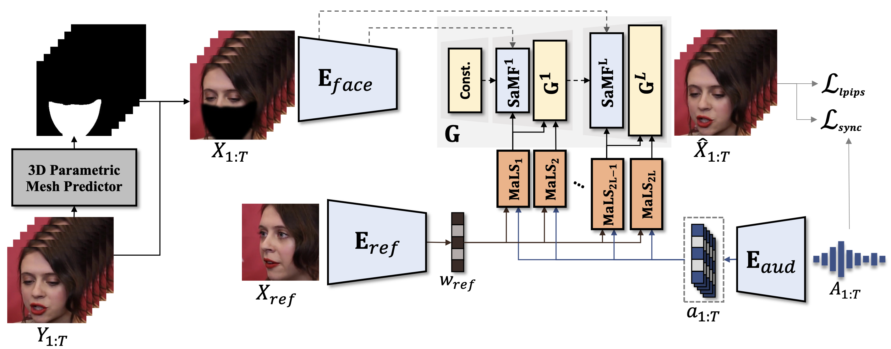

# Face Pose-aware-masking-Using-Mediapipe
# This Image Taken from StyleLipSync 
https://github.com/TaekyungKi/StyleLipSync

# From Mediapipe Doc


## Features
  This is simple Pose Aware Masking of Face 
  Based on given Landmarks cropping mask
  # Input Image
   
  
  # Mask Image
  
  

## Prerequisites

- Python
- 3.8

## Installation

```bash
pip install mediapipe==0.9.1.0
